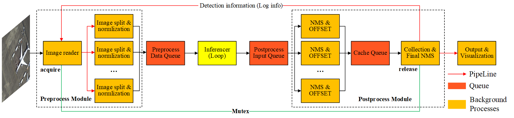
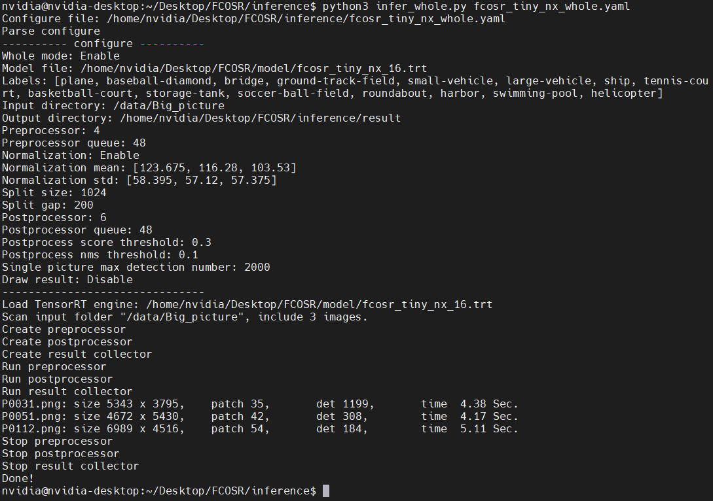

# FCOSR TensorRT Inference

> **[FCOSR: A Simple Anchor-free Rotated Detector for Aerial Object Detection](#)**<br>
> arXiv preprint ([arXiv:2111.10780](https://arxiv.org/abs/2111.10780)).


This implement is modified from [TensorRT/efficientdet](https://github.com/NVIDIA/TensorRT/tree/main/samples/python/efficientdet). 

The inference framework is shown bellow.


Detection result


Log


## Recommend system environments:
 - Jetson Xavier NX / Jetson AGX Xavier
 - python 3.6
 - JetPack 4.6
 - CUDA 10.2 (from JetPack)
 - cuDNN 8.2.1 (from JetPack)
 - OpenCV 4.1.1 (from JetPack)
 - TensorRT 8.0.1.6 (from JetPack)

## Install

```shell
pip install Cython
pip install -r requirements.txt
```

**Note:** DOTA_devkit. [INSTALL.md](https://github.com/lzh420202/FCOSR/blob/master/install.md#install-fcosr)

## Test result on Jetson AGX Xavier

Dota1.0 test set

|name|size|patch size|gap|patches|det objects|det time(s)|
|-|-|-|-|-|-|-|
|P0031.png|5343×3795|1024|200|35|1197|2.75|
|P0051.png|4672×5430|1024|200|42|309|2.38|
|P0112.png|6989×4516|1024|200|54|184|3.02|
|P0137.png|5276×4308|1024|200|35|66|1.95|
|P1004.png|7001×3907|1024|200|45|183|2.52|
|P1125.png|7582×4333|1024|200|54|28|2.95|
|P1129.png|4093×6529|1024|200|40|70|2.23|
|P1146.png|5231×4616|1024|200|42|64|2.29|
|P1157.png|7278×5286|1024|200|63|184|3.47|
|P1378.png|5445×4561|1024|200|42|83|2.32|
|P1379.png|4426×4182|1024|200|30|686|1.78|
|P1393.png|6072×6540|1024|200|64|893|3.63|
|P1400.png|6471×4479|1024|200|48|348|2.63|
|P1402.png|4112×4793|1024|200|30|293|1.68|
|P1406.png|6531×4182|1024|200|40|19|2.19|
|P1415.png|4894x4898|1024|200|36|190|1.99|
|P1436.png|5136×5156|1024|200|42|39|2.31|
|P1448.png|7242×5678|1024|200|63|51|3.41|
|P1457.png|5193×4658|1024|200|42|382|2.33|
|P1461.png|6661×6308|1024|200|64|27|3.45|
|P1494.png|4782×6677|1024|200|48|70|2.61|
|P1500.png|4769×4386|1024|200|36|92|1.96|
|P1772.png|5963×5553|1024|200|49|28|2.70|
|P1774.png|5352×4281|1024|200|35|291|1.95|
|P1796.png|5870×5822|1024|200|49|308|2.74|
|P1870.png|5942×6059|1024|200|56|135|3.04|
|P2043.png|4165×3438|1024|200|20|1479|1.49|
|P2329.png|7950×4334|1024|200|60|83|3.26|
|P2641.png|7574×5625|1024|200|63|269|3.41|
|P2642.png|7039×5551|1024|200|63|451|3.50|
|P2643.png|7568×5619|1024|200|63|249|3.40|
|P2645.png|4605×3442|1024|200|24|357|1.42|
|P2762.png|8074×4359|1024|200|60|127|3.23|
|P2795.png|4495×3981|1024|200|30|65|1.64|

## How to use

We define configure file (yaml) to replace plenty of args.
```shell
# Small pictures inference mode
python infer_multi.py fcosr_tiny_nx.yaml
# Big whole picture inference mode
python infer_whole.py fcosr_tiny_agx_whole.yaml
```

A configure file demo is:
```yaml
whole_mode: 1  # whole mode switch
model:
  engine_file: '/home/nvidia/Desktop/FCOSR/model/epoch_36_16_lite_nx.trt' # TensorRT engine file path
  labels: 'labels.txt' # calss name
  num_speed: 2000 # FPS compute
io:
  input_dir: '/home/nvidia/DOTA_TEST/images/' # image folder path
  output_dir: 'result' # output
preprocess: # preprocess configure
  num_process: 8 # multi process
  queue_length: 40
  normalization: # normalization parameters
    enable: 1 # switch
    mean:
      - 123.675
      - 116.28
      - 103.53
    std:
      - 58.395
      - 57.12
      - 57.375
  split:    # split configure, only support whole mode.
    subsize: 1024
    gap: 200
postprocess: # postprocess configure
  num_process: 6 # multi process
  queue_length: 40
  nms_threshold: 0.1 # poly nms threshold 
  score_threshold: 0.1 # poly nms score threshold
  max_det_num: 2000
  draw_image: # visualization configure
    enable: 0 # switch
    output_dir: 'result' # output
    num: 20 # number
```
